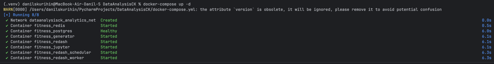
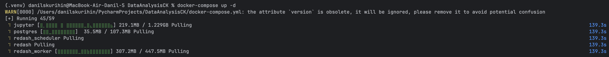
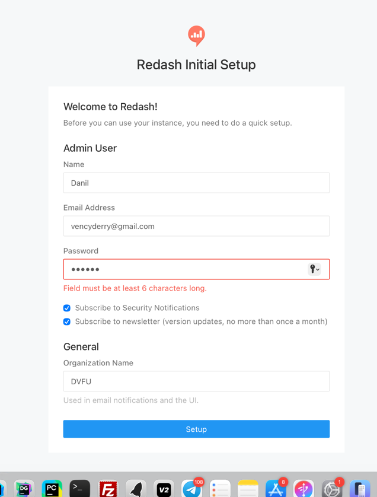
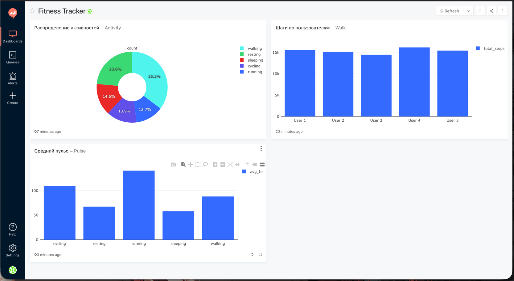

# Фитнес-трекер: мини-система сбора и анализа данных

Система имитирует поток данных с фитнес-устройства, сохраняет их в PostgreSQL и предоставляет инструменты для визуализации (Redash) и анализа (Jupyter Notebook).
Выполнил студент: Скурихин Данил

## Компоненты системы

- **PostgreSQL** — база данных для хранения событий
- **Generator** — python-скрипт, генерирующий реалистичные данные каждую секунду
- **Redash** — платформа для создания дашбордов и визуализаций
- **Jupyter Notebook** — среда для анализа данных

## Структура данных

Таблица `fitness_events`:

| Поле | Тип | Описание |
|------|-----|----------|
| id | SERIAL | первичный ключ |
| timestamp | TIMESTAMP | время записи |
| user_id | INTEGER | идентификатор пользователя (1-5) |
| steps | INTEGER | количество шагов |
| heart_rate | INTEGER | пульс (уд/мин) |
| calories | DECIMAL | сожженные калории |
| activity_type | VARCHAR | тип активности |

Типы активности: `sleeping`, `resting`, `walking`, `running`, `cycling`

## Запуск

### Требования

- Docker
- Docker Compose

### Команды

```bash
# запуск всей системы
docker-compose up -d

# просмотр логов генератора
docker-compose logs -f generator

# остановка системы
docker-compose down

# полная очистка (включая данные)
docker-compose down -v
```

## Доступ к сервисам

| Сервис | URL | Данные для входа |
|--------|-----|------------------|
| Redash | http://localhost:5001 | создать при первом запуске |
| Jupyter | http://localhost:8888 | токен: `fitness123` |
| PostgreSQL | localhost:5432 | user: `fitness`, password: `fitness123` |

## Настройка Redash

### Первый запуск

1. Инициализировать базу Redash:
```bash
docker-compose run --rm redash create_db
```

2. Открыть http://localhost:5001

3. Создать аккаунт администратора

4. Добавить Data Source:
   - Type: PostgreSQL
   - Host: postgres
   - Port: 5432
   - Database: fitness_db
   - User: fitness
   - Password: fitness123

### Примеры запросов для визуализаций

**1. Последние события (таблица):**
```sql
SELECT timestamp, user_id, activity_type, steps, heart_rate, calories
FROM fitness_events
ORDER BY timestamp DESC
LIMIT 100
```

**2. Распределение активностей (pie chart):**
```sql
SELECT activity_type, COUNT(*) as count
FROM fitness_events
GROUP BY activity_type
```

**3. Средний пульс по активностям (bar chart):**
```sql
SELECT activity_type, ROUND(AVG(heart_rate), 1) as avg_heart_rate
FROM fitness_events
GROUP BY activity_type
ORDER BY avg_heart_rate DESC
```

**4. Суммарные шаги по пользователям (bar chart):**
```sql
SELECT user_id, SUM(steps) as total_steps
FROM fitness_events
GROUP BY user_id
ORDER BY user_id
```

**5. Динамика пульса во времени (line chart):**
```sql
SELECT
    DATE_TRUNC('minute', timestamp) as time_bucket,
    ROUND(AVG(heart_rate), 1) as avg_heart_rate
FROM fitness_events
WHERE timestamp > NOW() - INTERVAL '1 hour'
GROUP BY time_bucket
ORDER BY time_bucket
```

## Jupyter Notebook

Ноутбук находится в `notebooks/analysis.ipynb` и доступен по адресу http://localhost:8888

Анализ включает:
- загрузку данных из PostgreSQL
- описательную статистику
- визуализации (matplotlib, seaborn)
- корреляционный анализ
- анализ временных рядов

## Скриншоты

### Запуск системы


### Загрузка образов


### Регистрация в Redash


### Дашборд Redash


## Структура проекта

```
DataAnalysisCK/
├── docker-compose.yml      # конфигурация контейнеров
├── generator/
│   ├── Dockerfile          # образ генератора
│   ├── generator.py        # скрипт генерации данных
│   └── requirements.txt    # зависимости python
├── init/
│   └── init.sql            # инициализация бд
├── notebooks/
│   └── analysis.ipynb      # jupyter notebook с анализом
└── README.md               # документация
```
